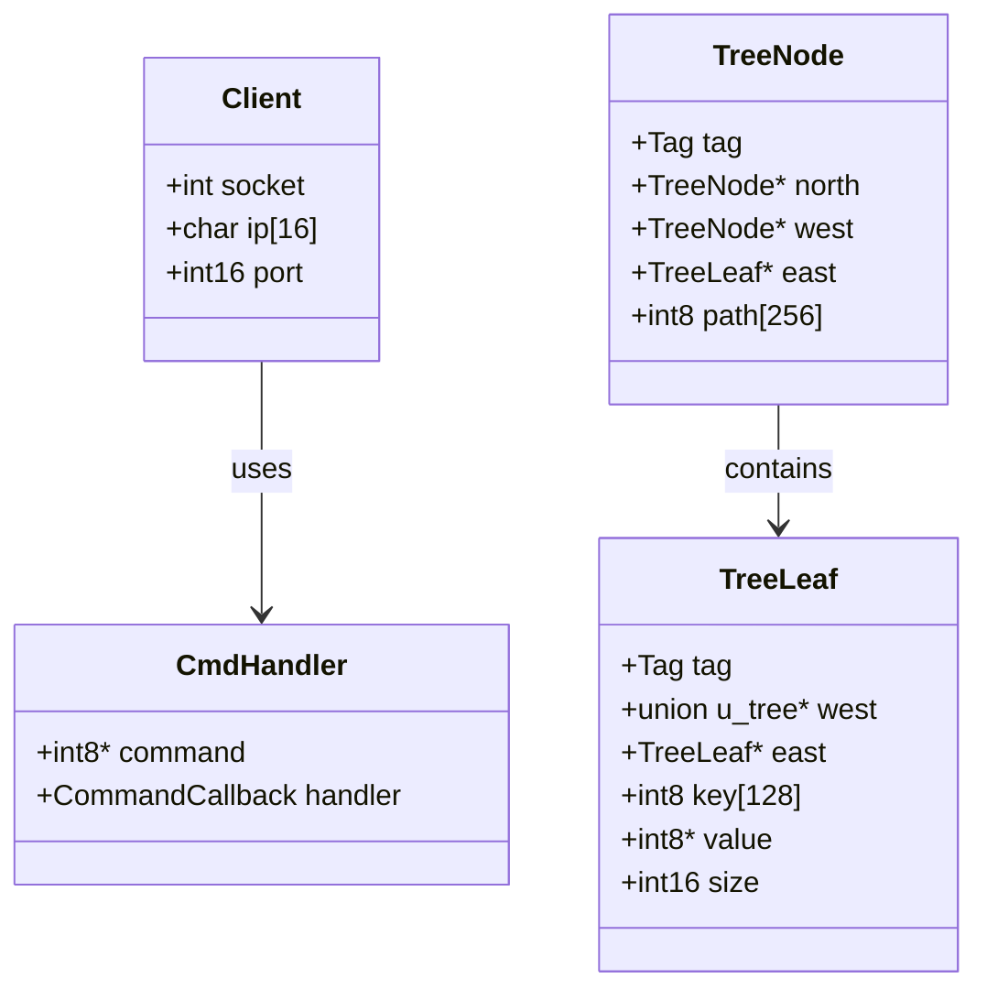

# MeowDB : Redis-like Database Server

**[Русский](ref/RU.md)**

This project implements a Redis-like database server in C, supporting basic operations such as create, insert, select, update, and delete. The server uses a tree-based data structure to store key-value pairs and handles client connections using sockets.

_This project is based on a tutorial taught by Dr. Birch (**[Youtube](https://youtube.com/@dr-Jonas-Birch)** | **[Website](doctorbirch.com)**)_

{width="200" height="200" style="display: block !important; margin: auto !important;"}

## Features
- **Create**: Add a new key-value pair to the database.
- **Insert**: Insert or update a key-value pair.
- **Select**: Retrieve the value associated with a key.
- **Update**: Modify the value of an existing key.
- **Delete**: Remove a key-value pair from the database.
- **Hello**: A simple command to test the server connection.

## Technical Details

### Data Structures
- **Tree**: The database uses a tree structure to store key-value pairs. Each node in the tree can be either a `TreeNode` or a `TreeLeaf`.
  - `TreeNode`: Represents a node in the tree, containing pointers to child nodes and a path.
  - `TreeLeaf`: Represents a leaf in the tree, containing a key, value, and size.

### Server Architecture
- **Client Connection**: The server handles client connections using sockets. Each client connection is managed in a separate process using `fork()`.
- **Command Handlers**: The server supports multiple commands, each handled by a specific function. The command handlers are defined in an array of `CmdHandler` structures.

### Networking Details
The server listens on a specified port (default: `6969`) for incoming client connections. When a client connects, the server forks a new process to handle the client's requests. The server supports the following commands:

- `create <key> <value>`: Create a new key-value pair.
- `insert <key> <value>`: Insert or update a key-value pair.
- `select <key>`: Retrieve the value associated with a key.
- `update <key> <value>`: Update the value of an existing key.
- `delete <key>`: Delete a key-value pair.
- `hello`: Test the server connection.

### Compilation and Execution
To compile and run the server, use the following commands:

```bash
make
./Cache [port]
```

Replace `[port]` with the desired port number. If no port is specified, the server will use the default port `6969`.

### Example Queries and Results
Here are some example queries and their expected results:

1. **Create a new key-value pair**:
   ```bash
   create mykey myvalue
   ```
   **Result**:
   ```
   Key 'mykey' created with value 'myvalue'.
   ```

2. **Insert or update a key-value pair**:
   ```bash
   insert mykey newvalue
   ```
   **Result**:
   ```
   Key 'mykey' updated with value 'newvalue'.
   ```

3. **Select a value by key**:
   ```bash
   select mykey
   ```
   **Result**:
   ```
   Value for 'mykey': newvalue
   ```

4. **Delete a key-value pair**:
   ```bash
   delete mykey
   ```
   **Result**:
   ```
   Key 'mykey' deleted.
   ```

5. **Test the server connection**:
   ```bash
   hello
   ```
   **Result**:
   ```
   Hello from the Cache server!
   ```

## UML Diagram

