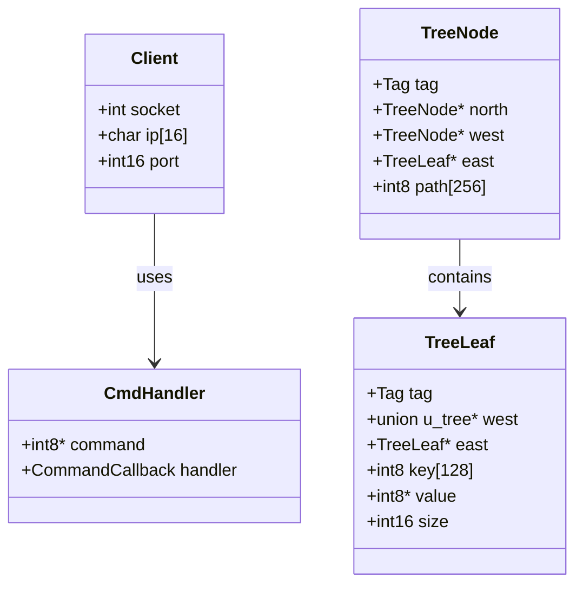

# MeowDB : Сервер баз данных, подобный Redis

**[English](../README.md)**

Этот проект реализует сервер базы данных типа Redis на языке C, поддерживающий базовые операции, такие как создание, вставка, выбор, обновление и удаление. Сервер использует древовидную структуру данных для хранения пар ключ-значение и обрабатывает клиентские соединения с помощью сокетов.

_Этот проект основан на уроке, который ведет доктор Бирч (**[Youtube](https://youtube.com/@dr-Jonas-Birch)** | **[Веб-сайт](https://doctorbirch.com)**)_

{width="200" height="200" style="display: block !important; margin: auto !important;"}

## Функции
- **Create**: Добавьте новую пару ключ-значение в базу данных.
- **Insert**: Вставьте или обновите пару ключ-значение.
- **Select**: Получить значение, связанное с ключом.
- **Update**: Измените значение существующего ключа.
- **Delete**: Удалить пару ключ-значение из базы данных.
- **Hello**: Простая команда для проверки соединения с сервером.

## Технические подробности

### Структуры данных
- **Дерево**: База данных использует древовидную структуру для хранения пар ключ-значение. Каждый узел в дереве может быть либо `TreeNode`, либо `TreeLeaf`.
  - `TreeNode`: представляет узел в дереве, содержащий указатели на дочерние узлы и путь.
  - `TreeLeaf`: представляет лист дерева, содержащий ключ, значение и размер.

### Архитектура сервера
- **Подключение клиента**: Сервер обрабатывает клиентские соединения с помощью сокетов. Каждое клиентское соединение управляется в отдельном процессе с помощью `fork()`.
- **Обработчики команд**: Сервер поддерживает несколько команд, каждая из которых обрабатывается определенной функцией. Обработчики команд определяются в массиве структур `CmdHandler`.

### Подробности сети
Сервер прослушивает указанный порт (по умолчанию: `6969`) на предмет входящих клиентских подключений. Когда клиент подключается, сервер разветвляет новый процесс для обработки запросов клиента. Сервер поддерживает следующие команды:

- `create <key> <value>`: Создайте новую пару ключ-значение.
- `insert <key> <value>`: Вставьте или обновите пару ключ-значение.
- `select <key>`: Получить значение, связанное с ключом.
- `update <key> <value>`: Обновите значение существующего ключа.
- `delete <key>`: Удалить пару ключ-значение.
- `hello`: Проверьте соединение с сервером.

### Составление и исполнение
Для компиляции и запуска сервера используйте следующие команды:

```bash
$ make
$ ./Cache [port]
```

Замените `[port]` на нужный номер порта. Если порт не указан, сервер будет использовать порт по умолчанию `6969`.

### Примеры запросов и результатов
Вот несколько примеров запросов и их ожидаемых результатов:
1. **Создайте новую пару ключ-значение**:
   ```bash
   create mykey myvalue
   ```
   **Выход**:
   ```
   Key 'mykey' created with value 'myvalue'.
   ```

2. **Вставьте или обновите пару ключ-значение**:
   ```bash
   insert mykey newvalue
   ```
   **Выход**:
   ```
   Key 'mykey' updated with value 'newvalue'.
   ```

3. **Выберите значение по ключу**:
   ```bash
   select mykey
   ```
   **Выход**:
   ```
   Value for 'mykey': newvalue
   ```

4. **Удалить пару ключ-значение**:
   ```bash
   delete mykey
   ```
   **Выход**:
   ```
   Key 'mykey' deleted.
   ```

5. **Проверьте соединение с сервером.**:
   ```bash
   hello
   ```
   **Выход**:
   ```
   Hello from the Cache server!
   ```

## Диаграмма

